class: center, middle

## Artificial Intelligence

# Machine Learning

<br>

Gerard Escudero, 2020

<br>


---
class: left, middle, inverse

# Outline

* .cyan[Introduction]

* Distances

* Probabilities

* Rules

* Hyperplanes

* Learning Theory

* References

---

# Classification Data Example

.center[
class      | sepal <br> length | sepal <br> width | petal <br> length | petal <br> width 
:--------- | -----: | ----: | -----: | ----: 
setosa     | 5.1    | 3.5   | 1.4    | 0.2   
setosa     | 4.9    | 3.0   | 1.4    | 0.2   
versicolor | 6.1    | 2.9   | 4.7    | 1.4   
versicolor | 5.6    | 2.9   | 3.6    | 1.3    
virginica  | 7.6    | 3.0   | 6.6    | 2.1    
virginica  | 4.9    | 2.5   | 4.5    | 1.7   
150 rows or examples (50 per class).red[*] 
]

* The .blue[class] or .blue[target] column is usually refered as vector .blue[_Y_] 

* The matrix of the rest of columns (.blue[attributes] or .blue[features]) is usually referred
as matrix .blue[_X_]

.footnote[.red[*] _Source_ : _Iris_ problem UCI repository (Frank | Asunción, 2010)]

---

# Main objective

.large[Build from data a .blue[model] able to give a prediction to new .blue[unseen] examples.]

.center[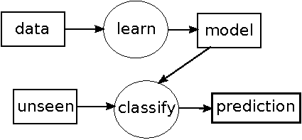]

where:
* _data = previous table_
* _unseen = [4.9, 3.1, 1.5, 0.1]_
* _prediction = "setosa"_

---

# Regression Data Example

.center[
quality | density | pH   | sulphates | alcohol
------- | ------- | ---- | --------- | -------
6       | 0.998   | 3.16 | 0.58      | 9.8
4       | 0.9948  | 3.51 | 0.43      | 11.4
8       | 0.9973  | 3.35 | 0.86      | 12.8
3       | 0.9994  | 3.16 | 0.63      | 8.4
7       | 0.99514 | 3.44 | 0.68      | 10.55
1599 examples | 12 columns (11 attributes + 1 target).red[*]
]

The main diference between classification and regression is the _Y_ or target values:

* .blue[Classification]: discrete or nominal values <br>
Example: _Iris_, {“setosa”, “virginica”, “versicolor”}.

* .blue[Regression]: continuous or real values <br>
Example: _WineQuality_, values from 0 to 10.

.footnote[.red[*] _Source_ : _wine quality_ problem from UCI repository (Frank | Asunción, 2010)]
 

---


# Some Applications

### Classification

  - Medicine: diagnosis of diseases

  - Engineering: fault diagnosis and detection

  - Computer Vision: face recognition

  - Natural Language Processing: spam filtering

### Regression

  - Medicine: estimation of life after an organ transplant

  - Engineering: process simulation, prediction

  - Computer Vision: Face completion

  - Natural Language Processing: opinion detection

---
class: left, middle, inverse

# Outline

* .brown[Introduction]

* .cyan[Distances]

  - .cyan[kNN]

  - Centroids

* Probabilities

* Rules

* Hyperplanes

* Learning Theory

* References

---

# Distance-based methods

### Induction principle: .blue[distances]

- **euclidean**:

$$de(v, w) = \sqrt{\sum_{i=1}^n(v_i-w_i)^2}$$

$$n=\text{\#attributes}$$

- **hamming**:

$$dh(v, w) = \frac{\sum_{i=1}^n \delta(v_i, w_i)}{n} $$
$$\delta(a, b)=1\text{, if } a\neq b$$
$$\delta(a, b)=0\text{, if } a = b$$ 

---

# Distance-based methods

### Documentation in .blue[sklearn]

.tiny[[https://scikit-learn.org/stable/modules/generated/sklearn.neighbors.DistanceMetric.html](https://scikit-learn.org/stable/modules/generated/sklearn.neighbors.DistanceMetric.html)]

### Some algorithms

- *k* Nearest Neightbors (kNN)

- Centroids (or Linear Classifier)

---

# Distance-based methods

* How can be give a prediction to next examples?

.center[
| class | sep-len | sep-wid | pet-len | pet-wid |
|:------|:--------|:--------|:--------|:--------|
| ??    | 4.9     | 3.1     | 1.5     | 0.1     |
Unseen classification example on _Iris_]

.center[
| target | density | pH   | sulphates | alcohol |
|:-------|:--------|:-----|:----------|:--------|
| ??     | 0.99546 | 3.29 | 0.54      | 10.1    |
Unseen regression example on _WineQuality_]

* Let’s begin with a representation of the problems...

---

# Classification Data Example

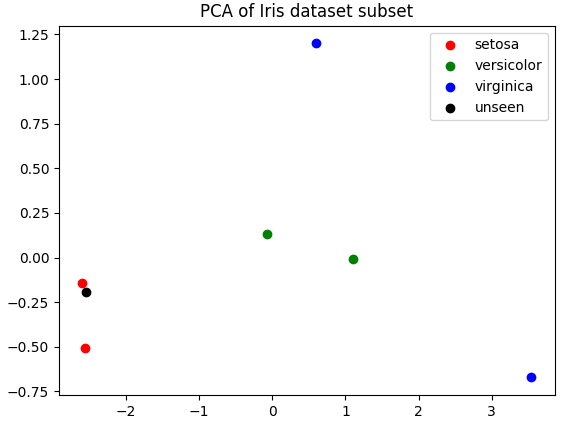

---

# Regression Data Example

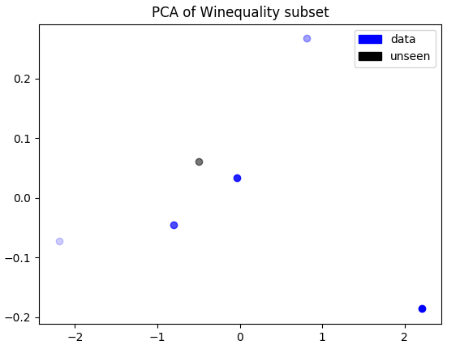

---

# 1 Nearest Neighbors algorithm

### Algorithm
* classification | regression

$$h(T)=y_i$$

$$i = argmin_i (distance(X_i,T))$$

### Examples

* .blue[classification] example (Iris):
  - distances: [0.47, 0.17, 3.66, 2.53, 6.11, 3.45]
  - prediction = setosa (0.17)

* .blue[regression] example (WineQuality):
  - distances: [0.33, 1.32, 2.72, 1.71, 0.49] 
  - prediction = 6 (0.33)

---

# *k* Nearest Neighbors algorithm

### Algorithm 

1. build the set $S$ of $k$ $y_i$'s with minimum distance to unseen example $T$ (as in 1NN)

2. prediction:

$$h(T)=mode(S)\text{, if classification}$$

$$h(T)=average(S)\text{, if regression}$$

### Examples

- .blue[classification]: Iris | euclidean distance

$$h(T)=mode({setosa, setosa, versicolor})=setosa$$

- .blue[regression]: WineQuality | euclidean distance

$$h(T)=average({6,4,7})=5.7$$


---

# Some issues

- *k* value uses to be *odd* or *prime* number to avoid .blue[ties]

- an usual modification of the algorithm is to .blue[weight] points by the inverse of their distance in mode or average functions

- .blue[lazy learning]: it does nothing in learning step; it calculates all in classification step 

  - This can produce some problems real time applications

  - This mades *k*NN one of the most useful algorithm for missing values imputation

- .blue[nominal features]

  - changing the distance (ie: *hamming*)

  - codifying them as numerical (to see in lab)


---

# sklearn

#### .blue[Classification]:

```python3
from sklearn.neighbors import KNeighborsClassifier
k = 3
clf = KNeighborsClassifier(k)
```

#### .blue[Regression]:

```python3
from sklearn.neighbors import KNeighborsRegressor
k = 3
rgs = KNeighborsRegressor(k)
```

#### Usual parameters:

```python3
clf = KNeighborsClassifier(k, weights='distance')
# for weighted majority votes or average
```

#### User guide: 

.tiny[[https://scikit-learn.org/stable/modules/neighbors.html](https://scikit-learn.org/stable/modules/neighbors.html)]

---
class: left, middle, inverse

# Outline

* .brown[Introduction]

* .cyan[Distances]

  - .brown[kNN]

  - .cyan[Centroids]

* Probabilities

* Rules

* Hyperplanes

* Learning Theory

* References

---

# Classification Data Example

.center[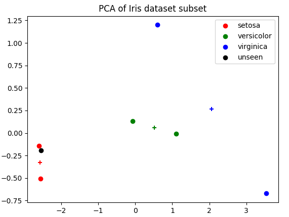]

---

# Centroids algorithm

#### .blue[Learn]: model=centroids (averaging columns for each class)

#### Example: Iris 

| centroids |   |   |   |   |
|-----------|---|---|---|---|
| setosa | 5.0 | 3.25 | 1.4 | 0.2 |
| versicolor | 5.85 | 2.9 | 4.15 | 1.35 |
| virginica | 6.25 | 2.75 | 5.55 | 1.9 |

#### .blue[Classify]: apply 1NN with centroids as data 

#### Example: Iris | euclidean distance 

$$distances = (0.23, 3.09, 4.65)$$

$$prediction=setosa (0.23)$$

---

# sklearn

#### .blue[Classification]:

```python3
from sklearn.neighbors import NearestCentroid
clf = NearestCentroid()
```

#### It has no parameters

#### User guide: 

.tiny[[https://scikit-learn.org/stable/modules/neighbors.html#nearest-centroid-classifier](https://scikit-learn.org/stable/modules/neighbors.html#nearest-centroid-classifier)]

---
class: left, middle, inverse

# Outline

* .brown[Introduction]

* .brown[Distances]

* .cyan[Probabilities]

  - .cyan[Naïve Bayes]

  - LDA 

  - Logistic Regression

* Rules

* Hyperplanes

* Learning Theory

* References

---

# Probability-based methods

- Induction principle: .blue[probabilities]

| class      | cap-shape | cap-color | gill-size | gill-color |
|:-----------|:----------|:----------|:----------|:-----------|
| poisonous  | convex    | brown     | narrow    | black      |
| edible     | convex    | yellow    | broad     | black      |
| edible     | bell      | white     | broad     | brown      |
| poisonous  | convex    | white     | narrow    | brown      |
| edible     | convex    | yellow    | broad     | brown      |
| edible     | bell      | white     | broad     | brown      |
| poisonous  | convex    | white     | narrow    | pink       |
.center[up to 8 124 examples | 22 attributes .red[*]]

- What is .blue[$P(poisonous)$]?

.footnote[.red[*]  _Source_ : _Mushroom_ problem from UCI repository (Frank | Asunción, 2010)]

---

# Probability-based methods

- In most cases we estimate it from data (.blue[maximum likelihood estimation])

$$P(poisonous)=\frac{N(poisonous)}{N}=\frac{3}{7}\approx 0.429$$

- How can be give a prediction from probabilities to next example? 

| class | cap-shape | cap-color | gill-size | gill-color |
|:------|:----------|:----------|:----------|:-----------|
| ??    | convex    | brown     | narrow    | black      |

- Some algorithms:

  - Naïve Bayes

  - LDA (Linear Discriminant Analysis)

  - Logistic regression

---

# Naïve Bayes

#### .blue[Learning Model]

$$\text{model}=[P(y)\simeq\frac{N(y)}{N},P(x_i|y)\simeq\frac{N(x_i|y)}{N(y)};\forall y \forall x_i]$$

.col5050[
.col1[
| $y$       | $P(y)$ |
|:----------|-------:|
| poisonous | 0.429  |
| edible    | 0.571  |
]
.col2[
| attr:value       | poisonous | edible |
|:-----------------|----------:|-------:|
| cap-shape:convex | 1         | 0.5    |
| cap-shape:bell   | 0         | 0.5    |
| cap-color:brown  | 0.33      | 0      |
| cap-color:yellow | 0         | 0.5    |
| cap-color:white  | 0.67      | 0.5    |
| gill-size:narrow | 1         | 0      |
| gill-size:broad  | 0         | 1      |
| gill-color:black | 0.33      | 0.25   |
| gill-color:brown | 0.33      | 0.75   |
| gill-color:pink  | 0.33      | 0      |
]
]

---

# Naïve Bayes

#### .blue[Classification]

$$h(T) \approx argmax_y P(y)\cdot P(t_1|y)\cdot\ldots\cdot P(t_n|y)$$

- Test example $T$:

| class | cap-shape | cap-color | gill-size | gill-color |
|:------|:----------|:----------|:----------|:-----------|
| ??    | convex    | brown     | narrow    | black      |

- Numbers:
$$P(poisonous|T) = 0.429 \cdot 1 \cdot 0.33 \cdot 1 \cdot 0.33 = 0.047$$
$$P(edible|T) = 0.571 \cdot 0.5 \cdot 0 \cdot 0 \cdot 0.25 = 0$$
- Prediction: $$h(T) = poisonous$$

---

# Naïve Bayes

#### .blue[Notes]:

- It needs a smoothing technique to avoid zero counts <br>
  - Example: Laplace
$$P(x_i|y)\approx\frac{N(x_i|y)+1}{N(y)+N}$$

- It assumes conditional independence between every pair of features

- It is empiricaly a decent classifier but a bad estimator
  - This means that $P(y|T)$ is not a good probability 

---

# Gaussian Naïve Bayes

#### What about numerical features?

.blue[Gaussian Naïve Bayes] is an implementation assuming gaussian distribution:

$$P(x_i|y)=\frac{1}{\sqrt{2\pi\sigma_y^2}}\exp\left(-\frac{(x_i-\mu_y)^2}{2\sigma_y^2}\right)$$

#### sklearn:

.blue[Classification]:

```python3
from sklearn.naive_bayes import GaussianNB
clf = GaussianNB()
```
It has no .blue[parameters]

.blue[User guide]: 

.tiny[[https://scikit-learn.org/stable/modules/naive_bayes.html](https://scikit-learn.org/stable/modules/naive_bayes.html)]

---
class: left, middle, inverse

# Outline

* .brown[Introduction]

* .brown[Distances]

* .cyan[Probabilities]

  - .brown[Naïve Bayes]

  - .cyan[LDA]

  - Logistic Regression

* Rules

* Hyperplanes

* Learning Theory

* References

---

# Linear Discriminant Analysis

also from bayes rule | gaussian distributions:

$$h(T)\simeq argmax_y\frac{P(T|y)P(y)}{P(T)}$$

where $d$ = number of features and:

$$P(X)=\sum_{\forall y}P(X|y)P(y)$$

$$P(y)=\frac{N(y)}{N}$$

$$P(X|y)=\frac{1}{\sqrt{(2\pi)^d\vert\sum_k\vert}}\exp\left(-\frac{1}{2}(X-\mu_y)^T\sum_k^{-1}(X-\mu_k)\right)$$

---

# Dimensionality reduction

#### PCA vs LDA:

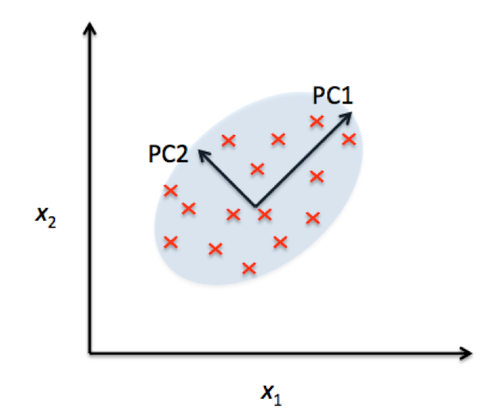
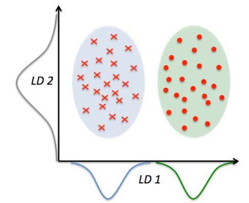

.tiny[.red[Source]: [https://sebastianraschka.com/faq/docs/lda-vs-pca.html](https://sebastianraschka.com/faq/docs/lda-vs-pca.html)]

---

# sklearn

#### .blue[Dimensionality reduction]: 

```Python3
from sklearn.decomposition import PCA
pca = PCA(n_components=2)
Xpca = pca.fit(X).transform(X)

from sklearn.discriminant_analysis import LinearDiscriminantAnalysis
lda = LinearDiscriminantAnalysis(n_components=2)
Xlda = lda.fit(X, Y).transform(X)
```

#### .blue[Classification]: 

```Python3
from sklearn.discriminant_analysis import LinearDiscriminantAnalysis
clf = LinearDiscriminantAnalysis(shrinkage='auto',solver='lsqr')
```

#### .blue[User Guide]:

.tiny[[https://scikit-learn.org/stable/modules/lda_qda.html](https://scikit-learn.org/stable/modules/lda_qda.html)]

---
class: left, middle, inverse

# Outline

* .brown[Introduction]

* .brown[Distances]

* .cyan[Probabilities]

  - .brown[Naïve Bayes]

  - .brown[LDA]

  - .cyan[Logistic Regression]

* Rules

* Hyperplanes

* Learning Theory

* References

---

# Logistic Regression 

- Also known as Maximum Entropy

- Regression of the probability

- .blue[Binary Classification]:

$$h_\theta(x)=\sigma(x^T\theta)$$

$$sigma(t)=\frac{1}{1+\exp(-t)}$$

.center[]

.tiny[.red[Source]: [https://en.wikipedia.org/wiki/Logistic_function](https://en.wikipedia.org/wiki/Logistic_function)]

---

# sklearn

#### .blue[Classification]:

```Python3
from sklearn.linear_model import LogisticRegression
clf = LogisticRegression()
```
#### .blue[Parameters]:

```Python3
solver = default 'lbfgs'
max_iter = default 100
```

#### .blue[User guide]:

.tiny[[https://scikit-learn.org/stable/modules/linear_model.html#logistic-regression](https://scikit-learn.org/stable/modules/linear_model.html#logistic-regression)]

---
class: left, middle, inverse

# Outline

* .brown[Introduction]

* .brown[Distances]

* .brown[Probabilities]

* .cyan[Rules]

  - .cyan[Decision Trees]

  - Ensembles

* Hyperplanes

* Learning Theory

* References

---

# Rules-based methods

-  Induction principle: .blue[rules]

| class | cap-shape | cap-color | gill-color |
|-------|-----------|-----------|------------|
| poisonous | convex | brown | black |
| edible | convex | yellow | black |
| edible | bell | white | brown |
| poisonous | convex | white | brown |
| edible | convex | yellow | brown |
| edible | bell | white | brown |
| poisonous | convex | white | pink |
.center[up to 8124 examples | 22 attributes.red[*]]

- Which rules can be extracted from data? 

.blue[$$\text{gill-color}=\text{pink}\Longrightarrow\text{poisonous}$$]

.footnote[.red[*] .red[Source]: ``mushroom'' problem from UCI Repository (Frank | Asunción, 2010)]

---

# Decision Trees

.blue[Resulting tree]:

.center[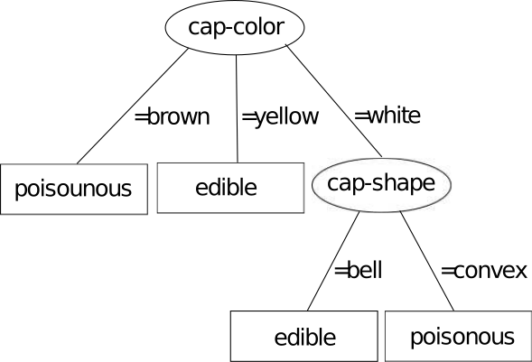]

.blue[Classification]: exploring the tree using test

| class | cap-shape | cap-color | gill-color |
|---|---|---|---|
| ?? | convex | brown | black |

.center[.blue[prediction: poisonous]]

---

# Learning Decision Trees

.blue[Learn]: 

build a tree by recursively splitting for one of the attributes with most accuracy

#### Example:

.blue[Step 1]: every attribute is evaluated.red[*]

$$\text{cap-shape}=\frac{3+2}{7}=0.71$$
$$\text{cap-color}=\frac{1+2+2}{7}=0.71$$
$$\text{gill-color}=\frac{1+3+1}{7}=0.71$$

.footnote[.red[*] the number of examples with the mode is assigned to each value]

---

# Learning Decision Trees

.blue[Step 2]: one of the best attributes is selected as a node of the tree: 

$$\text{cap-color}$$

.blue[Step 3]: for every value with only a class a leaf is created: 

$$\text{brown} \Longrightarrow \text{poisonous}$$

$$\text{yellow} \Longrightarrow \text{edible}$$

.blue[Step 4]: a new set is built for the rest of values

.center[_white_ examples without _cap-color_]

| class | cap-shape | gill-color |
|---|---|---|
| edible | bell | brown |
| poisonous | convex | brown |
| edible | bell | brown |
| poisonous | convex | pink |

---

# Learning Decision Trees

.blue[Step 5]: the algorithm restarts with previous set: 

$$\text{cap-shape}=\frac{2+2}{4}=1$$

$$\text{gill-color}=\frac{2+1}{4}=0.75$$

.blue[Step 6]: the algorithm ends when no attributes left or get full accuracy

---

# Cutting Points

- What about .blue[numerical attributes]?

| class | length | width |
|---|---|---|
| versicolor | 6.1 | 2.9 |
| versicolor | 5.6 | 2.9 |
| virginica | 7.6 | 3.0 |
| virginica | 4.9 | 2.5 |

- .blue[Cutting points] for _width_ attribute

| class | width | cutting points | accuracy |
|---|---:|---:|---|
| virginica | 2.5 | | |
| versicolor | 2.9 | 2.7 | $\frac{1+2}{4}=0.75$ |
| versicolor | 2.9 | | |
| virginica | 3.0 | 2.95 | $\frac{2+1}{4}=0.75$ |

---

# Cutting Points

#### Resulting .blue[tree]:

.center[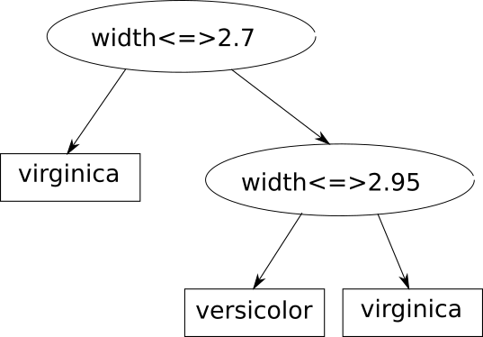]

---

# ID3

#### .blue[ID3]: decision tree variant
 
Entropy is a measure of the amount of uncertainty in the data:

$$H(S)=-\sum_{y\in Y}p(y)log_2(p(y))$$

Information gain is a measure of the difference of entropy before and after splitting:

.center[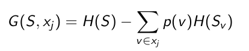]

<!---
$$G(S,x_j)=H(S)-\sum_{v\in x_j}p(v)H(S_v)$$
-->

---

# CART

#### .blue[CART]: another decision tree variant

- Gini impurity is a measure of how often a randomly chosen element from the set would be incorrectly labeled 

$$IG(p)=1-\sum_{y\in Y}p_y^2$$

.center[It is used instead of entropy]

- It allows regression

- Example:

.center[.tiny[[https://sefiks.com/2018/08/27/a-step-by-step-cart-decision-tree-example/](https://sefiks.com/2018/08/27/a-step-by-step-cart-decision-tree-example/)]]

.center[It also contains a regression example]

---

# Some Issues

Models looks like.red[*]:

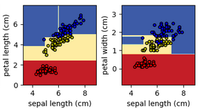
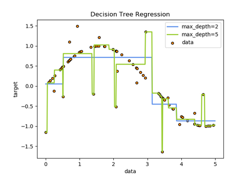

- Resulting rules are very understandable for humans

- Normalization do not affects trees

- Complex and big trees tends to overfitting (they do not generalize very well)

- Small changes in data may produce big different trees

.footnote[.red[*] .red[Source]: [https://scikit-learn.org/stable/modules/tree.html](https://scikit-learn.org/stable/modules/tree.html)]

---

# sklearn

#### .blue[Classification]:

```Python3
from sklearn.tree import DecisionTreeClassifier 
clf = DecisionTreeClassifier()
```

#### .blue[Regression]:

```Python3
from sklearn.tree import DecisionTreeRegressor
rgs = DecisionTreeRegressor()
```

#### .blue[Parameters]:

```Python3
criterion = 'entropy' or 'gini'
max_depth = int or None
```

#### .blue[User Guide]:

.tiny[[https://scikit-learn.org/stable/modules/tree.html](https://scikit-learn.org/stable/modules/tree.html)] 

---
class: left, middle, inverse

# Outline

* .brown[Introduction]

* .brown[Distances]

* .brown[Probabilities]

* .cyan[Rules]

  - .brown[Decision Trees]

  - .cyan[Ensembles]

* Hyperplanes

* Learning Theory

* References

---

# Ensembles

- Emsembles: combination of classifiers for improving generalization

- Meta-learners

- Two big families:

  - .blue[Averaging]: <br> average of predictions <br> improves reducing <br> _Bagging_ & _Random Forests_

  - .blue[Boosting]: <br> incrementally emphasizing in errors <br> improves reducing bias <br> _AdaBoost_ & _Gradient Boosting_

- Any base estimator algorithm, but the most used _Decision Trees_

- User Guide: <br>
[https://scikit-learn.org/stable/modules/ensemble.html](https://scikit-learn.org/stable/modules/ensemble.html)

---

# Bagging

#### .blue[Algoritm]:

- Set collection by randomly selecting with replacement from original data

- A estimator is built for each of the previous sets

- Prediction by averaging those of previous estimators

#### .blue[sklearn]:

```Python3
from sklearn.ensemble import BaggingClassifier
from sklearn.neighbors import KNeighborsClassifier
bagging = BaggingClassifier(KNeighborsClassifier())
...
# In a similar way with BaggingRegressor
```

#### User Guide: <br>
.tiny[[https://scikit-learn.org/stable/modules/ensemble.html#bagging](https://scikit-learn.org/stable/modules/ensemble.html#bagging)]

---

# Random Forests

It is a _bagging_ with _decision trees_ variant as base estimator <br>

Nodes in decision trees are selected among a random selection of features

#### .blue[sklearn]

```Python3
from sklearn.ensemble import RandomForestClassifier
clf = RandomForestClassifier(n_estimators=10)
...
# In a similar way with RandomForestRegressor
```

#### User Guide: <br>
[https://scikit-learn.org/stable/modules/ensemble.html#forest](https://scikit-learn.org/stable/modules/ensemble.html#forest)

---

# AdaBoost

#### .blue[Learning].red[*]:

- Learn a weak classifier at each iteration (sample distribution)

- At each iteration increases weight of errors and decreases the rest

.center[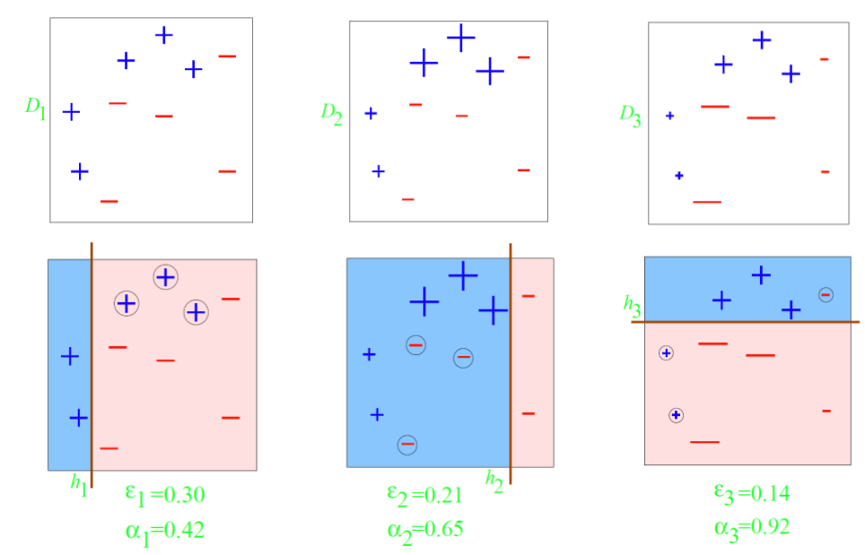]

.footnote[.red[*] .red[Source]: [https://www.cs.cmu.edu/~aarti/Class/10701/slides/Lecture10.pdf](https://www.cs.cmu.edu/~aarti/Class/10701/slides/Lecture10.pdf)]

---

# AdaBoost

#### .blue[Classification].red[*]:

$$H(X)=sign\left(\sum_{t=1}^T\alpha_th(X)\right)$$

.center[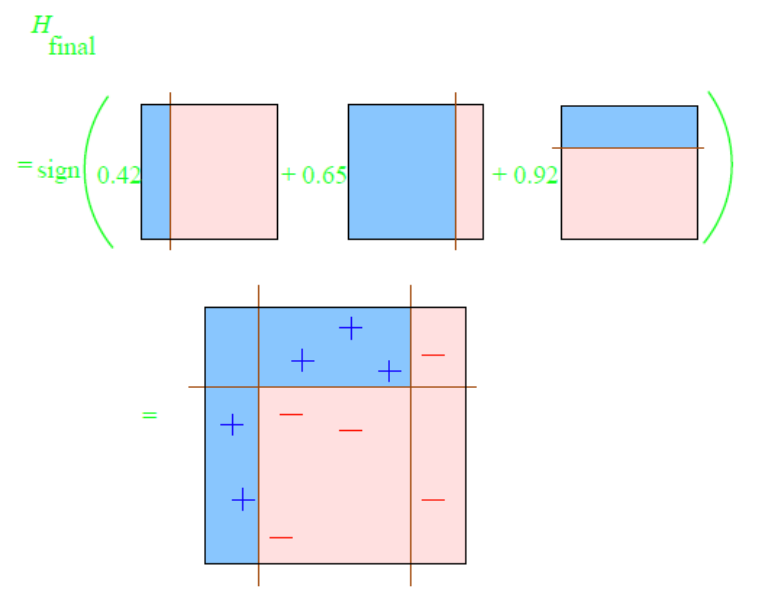]

.footnote[.red[*] .red[Source]: [https://www.cs.cmu.edu/~aarti/Class/10701/slides/Lecture10.pdf](https://www.cs.cmu.edu/~aarti/Class/10701/slides/Lecture10.pdf)]

---

# AdaBoost

#### .blue[sklearn]

```Python3
from sklearn.ensemble import AdaBoostClassifier
clf = AdaBoostClassifier()
...
# In a similar way with AdaBoostRegressor
```

Parameters:

```Python3
n_estimators=10
```

User Guide: <br>
[https://scikit-learn.org/stable/modules/ensemble.html#adaboost](https://scikit-learn.org/stable/modules/ensemble.html#adaboost) 

---

# Gradient Boosting

Generalization of boosting by optimizing (gradient descent) loss functions 

.tiny[Instead of training on a newly sample distribution, the weak learner trains on the remaining errors of the strong learner.]

#### sklearn:

```Python3
from sklearn.ensemble import GradientBoostingClassifier
clf = GradientBoostingClassifier()
...
# In a similar way with GradientBoostingRegressor
```

Parameters:

```Python3
n_estimators=10
max_depth=1
```

User Guide: <br>
[https://scikit-learn.org/stable/modules/ensemble.html#gradient-boosting](https://scikit-learn.org/stable/modules/ensemble.html#gradient-boosting)

XGBoost: another implementation <br>
[https://pandas-ml.readthedocs.io/en/latest/xgboost.html](https://pandas-ml.readthedocs.io/en/latest/xgboost.html)

---
class: left, middle, inverse

# Outline

* .brown[Introduction]

* .brown[Distances]

* .brown[Probabilities]

* .brown[Rules]

* .cyan[Hyperplanes]

  - .cyan[Kernels]

  - SVM

  - Neural Networks

* Learning Theory

* References

---

# Centroids

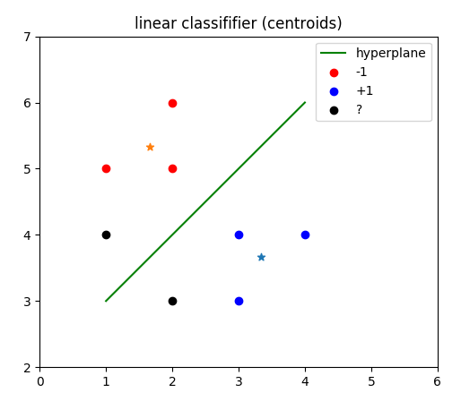

---

# Linear Classifier

.cols5050[
.col1[

#### Given: 
$P$: positive centroid <br>
$N$: negative centroid <br>
$\langle,\rangle$: dot product 

#### Formulae:

$h(T)=sign\left(\langle W,T\rangle+b\right)$

where:

$W=P-N$ 

$b=\frac{1}{2}(\langle P,P\rangle-\langle N,N\rangle)$

#### Implementation:

([html](codes/cl.html) / [ipynb](codes/cl.ipynb))
]
.col2[

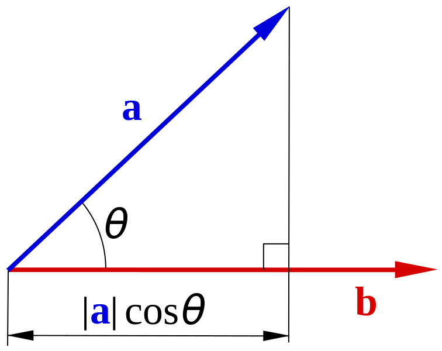
.center[.tiny[[https://sv.wikipedia.org/wiki/Fil:Scalar-product-dot-product.svg](https://sv.wikipedia.org/wiki/Fil:Scalar-product-dot-product.svg)]]

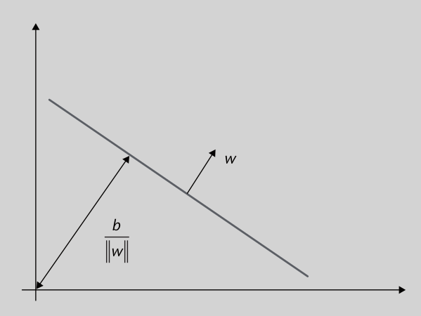

]]

---

# Linear Separability

Next data set is .blue[linearly not separable]

.center[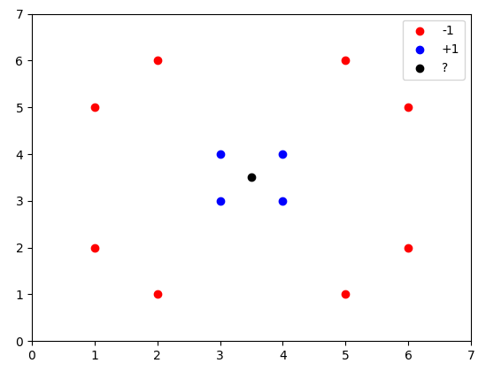]
 
.blue[Kernels] try to convert data sets to linearly separables through projections

---

# Kernels

Given a projection function $\phi(X)$ so as.red[*]:

.center[]

a .blue[kernel] will be:

$$\kappa(X,Z)=\langle\phi(X),\phi(Z)\rangle$$

.footnote[.red[*] .red[source]: [https://en.wikipedia.org/wiki/File:Kernel_Machine.svg](https://en.wikipedia.org/wiki/File:Kernel_Machine.svg)]


---

# Kernels

Kernel matrix:

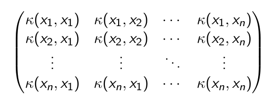

Usual Kernels.red[*]

- .blue[linear]: $\langle X,Z\rangle$

- .blue[polynomial]: $(\gamma\langle X,Z\rangle+r)^d$

- .blue[rbf] (radial basis function): $\exp(-\gamma\Vert X-Z\Vert^2)$

.footnote[.red[*] in sklearn: [https://scikit-learn.org/stable/modules/svm.html#svm-kernels](https://scikit-learn.org/stable/modules/svm.html#svm-kernels)]


---

# Kernel Centroids

Prediction function: 

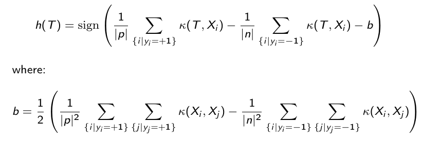

<!---
$$h(T)=\sign\left(\frac{1}{\vert p\vert}\sum_{\lbrace i\vert y_i=+1\rbrace}\kappa(T,X_i) - \frac{1}{\vert n\vert}\sum_{\lbrace i\vert y_i=-1\rbrace}\kappa(T,X_i) -b \right)$$
-->

#### Implementation:

([html](codes/kernels.html) / [ipynb](codes/kernels.ipynb))

---

# Some issues

- Kernels has been applied to many algorithms:

  - Centroids

  - PCA

  - k-means

  - SVMs

- Kernels can be adapted to the problem as another way to represent data

  - There are many kernels for structured data: trees, graphs, sets... <br>
Example: kernel for sets

$$\kappa(X,Z)=2^{\vert X\cap Z\vert}$$

---

# Kernel PCA

Representation of previous linearly no separable data set: 

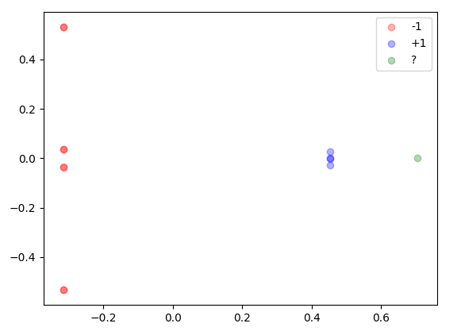

#### sklearn

```Python3
from sklearn.decomposition import KernelPCA
kpca = KernelPCA(kernel='rbf', gamma=1)
```

#### User Guide: <br>
[https://scikit-learn.org/stable/modules/decomposition.html#kernel-pca](https://scikit-learn.org/stable/modules/decomposition.html#kernel-pca)

---
class: left, middle, inverse

# Outline

* .brown[Introduction]

* .brown[Distances]

* .brown[Probabilities]

* .brown[Rules]

* .cyan[Hyperplanes]

  - .brown[Kernels]

  - .cyan[SVM]

  - Neural Networks

* Learning Theory

* References

---

# Support Vector Machines

#### Which are the best .blue[hyperplanes]?
 
.center[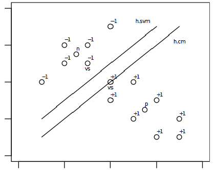]

Those that maximize the .blue[margin].

---

# Support Vectors

#### What are the .blue[support vectors]?

.center[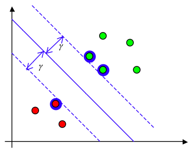]

Those nearest the margin.

---

# Classification

#### Prediction functions:

- Linear:

$$h(T)=\langle W,T\rangle + b = b + \sum_{\lbrace i\vert X_i\in SVs\rbrace} y_i \alpha_i \langle X_i,T\rangle$$

- General kernel:

$$h(T)=\langle W,\phi(T)\rangle + b = b + \sum_{\lbrace i\vert X_i\in SVs\rbrace} y_i \alpha_i \kappa(X_i,T)$$

---

# Soft Margin

#### SVMs allows some errors in the hyperplanes: 

.center[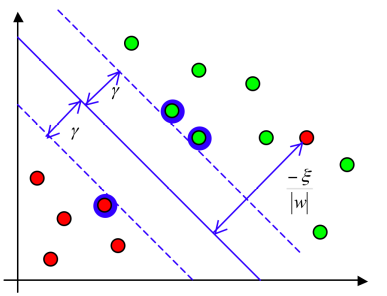]

This is called .blue[soft margin].

---

# Kernels in SVMs

- SVMs support kernels.red[*]:

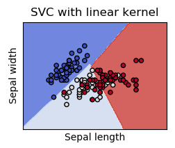
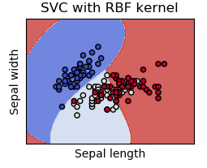

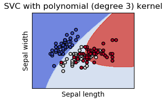

- It also support .blue[custom kernels].

.footnote[.red[*] .red[Source]: [https://scikit-learn.org/stable/modules/svm.html#svm-classification](https://scikit-learn.org/stable/modules/svm.html#svm-classification)]

---

# Support Vector Regression

- Which is the model for .blue[regression]? 


- It has an additional parameter: the $\varepsilon$-tube

.footnote[.red[*] .red[Source]: [https://www.saedsayad.com/support_vector_machine_reg.htm](https://www.saedsayad.com/support_vector_machine_reg.htm)]

---

# sklearn

.cols5050[
.col1[
#### Classification: 

```Python3
from sklearn.svm import SVC
clf = SVC()
```
]

.col2[
#### Regression: 

```Python3
from sklearn.svm import SVR
rgs = SVR()
```
]]

#### Parameters:

```Python3
kernel = 'linear', 'poly', 'rbf', 'precomputed'...
degree = 2, 3...
gamma = 'scale', 1, 0.1, 10...
C = 1, 10, 0.1  # penalty of soft margin
epsilon = 0.1
max_iter = -1, 1000...
```

#### User Guide: <br>
[https://scikit-learn.org/stable/modules/svm.html#svm-classification](https://scikit-learn.org/stable/modules/svm.html#svm-classification)

---
class: left, middle, inverse

# Outline

* .brown[Introduction]

* .brown[Distances]

* .brown[Probabilities]

* .brown[Rules]

* .cyan[Hyperplanes]

  - .brown[Kernels]

  - .brown[SVM]

  - .cyan[Neural Networks]

* Learning Theory

* References

---

# Artificial Neuron Model

.center[]

.center[]

.footnote[Source: [Artificial Neuron](http://www.gabormelli.com/RKB/Artificial_Neuron)]

---

# Perceptron

.cols5050[
.col1[

- Classification and regression

- Linear model

- Classification:

$$h(x)=f(\sum_{i=1}^n w_i x_i + b)$$

- Learning rule:

$$w_i'=w_i+\eta(h(x)-y)$$
]
.col2[


.center[]

]]

---

# sklearn

#### Classification:

```python3
from sklearn.linear_model import Perceptron
clf = Perceptron()
```

#### Parameters:

```Python3
max_iter: default=1000
```

#### User guide: <br>
.tiny[[https://scikit-learn.org/stable/modules/generated/sklearn.linear_model.Perceptron.html](https://scikit-learn.org/stable/modules/generated/sklearn.linear_model.Perceptron.html)]

---

# Multi-layer Perceptron

.col5050[
.col1[- One hidden layer

- Non-linear model

- Classification & regression

- [Backpropagation](https://en.wikipedia.org/wiki/Backpropagation) as training algorithm
]
.col2[

]]

- Activation functions:
  - ‘identity’: $f(x) = x$
  - ‘logistic’, $f(x) = 1 / (1 + exp(-x))$
  - ‘tanh’, $f(x) = tanh(x)$
  - ‘relu’, $f(x) = max(0, x)$

.footnote[Source: [wikipedia](https://en.wikipedia.org/wiki/Artificial_neural_network)]

---

# sklearn

#### Classification:

```python3
from sklearn.neural_network import MLPClassifier
clf = MLPClassifier(hidden_layer_sizes=(25,))
```

#### Regressor:

```python3
from sklearn.neural_network import MLPRegressor
clf = MLPRegressor(hidden_layer_sizes=(25,))
```

#### Parameters:

```Python3
hidden_layer_sizes: default (100,)
max_iter: default=200
```

#### User Guide: <br>
.tiny[[https://scikit-learn.org/stable/modules/generated/sklearn.neural_network.MLPClassifier.html#sklearn.neural_network.MLPClassifier](https://scikit-learn.org/stable/modules/generated/sklearn.neural_network.MLPClassifier.html#sklearn.neural_network.MLPClassifier)]


---
class: left, middle, inverse

# Outline

* .brown[Introduction]

* .brown[Distances]

* .brown[Probabilities]

* .brown[Rules]

* .brown[Hyperplanes]

* .cyan[Learning Theory]

* References

---

# Bias & variance example

- if 11 red points are the available data set:

.center[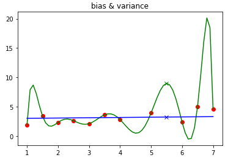]

- it can be approximated by:
  - a 10-degree polynomial: $R^2=1.0$
  - a straight line: $R^2=0.122$

- What happens to 5.5?

---

# Bias & Variance

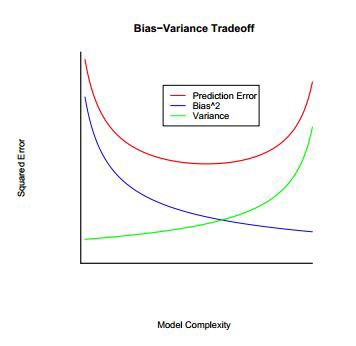
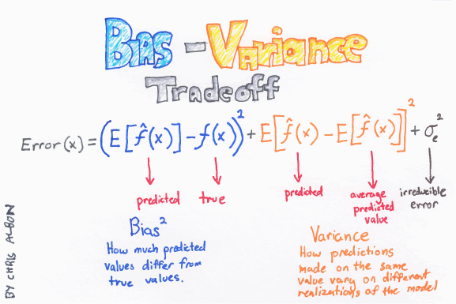

.footnote[.red[Source]: [https://towardsdatascience.com/regularization-the-path-to-bias-variance-trade-off-b7a7088b4577](https://towardsdatascience.com/regularization-the-path-to-bias-variance-trade-off-b7a7088b4577)]

---

# Bias & Variance

.cols5050[
.col1[
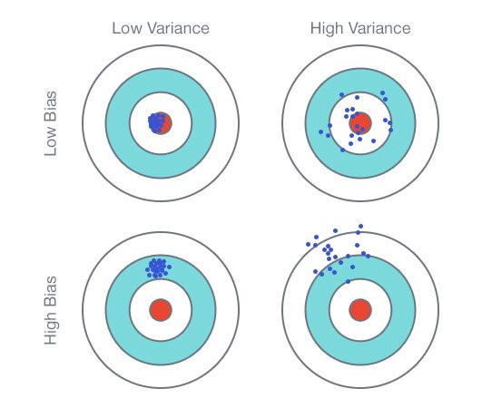
]

.col2[
1. trade-off
2. overfitting == low bias, high variance
3. underfitting == high bias, low variance
4. noise domine
]]

.footnote[.red[Source]: [https://towardsdatascience.com/regularization-the-path-to-bias-variance-trade-off-b7a7088b4577](https://towardsdatascience.com/regularization-the-path-to-bias-variance-trade-off-b7a7088b4577)]

---

# Gold Rules in Learning

- .blue[Occam's razor in learning]: <br><br>
simpler models are more likely to be correct than complex ones

- .blue[No free lunch theorem]: <br><br>
there is no method which outperforms all others for all data sets

- .blue[Curse of dimensionality]: <br><br>
when the dimensionality increases the amount of data needed to support the result often grows exponentially

---
class: left, middle, inverse

# Outline

* .brown[Introduction]

* .brown[Distances]

* .brown[Probabilities]

* .brown[Rules]

* .brown[Hyperplanes]

* .brown[Learning Theory]

* .cyan[References]

---

# References

- Aurélien Géron. _Hands-On Machine Learning with Scikit-Learn, Keras | Tensorflow_, 2nd Edition. O'Reilly, 2019.

- Gerard Escudero. _Machine Learning for Games_, 2019. ([url](https://gebakx.github.io/ml-games/#1))

- UCI Machine Learning Repository ([url](http://archive.ics.uci.edu/ml/index.php))

- jupyter: interative computing ([url](https://jupyter.org/documentation))

- pandas: python data analysis library ([url](http://pandas.pydata.org/pandas-docs/stable/))

- scikit-learn: machine learning in python ([url](https://scikit-learn.org/stable/index.html))

- pandas-ml: pandas machine learning ([url](https://pandas-ml.readthedocs.io/en/latest/index.html)

- tutorial markdown: lightweight syntax for writing ([url](https://guides.github.com/features/mastering-markdown/))

