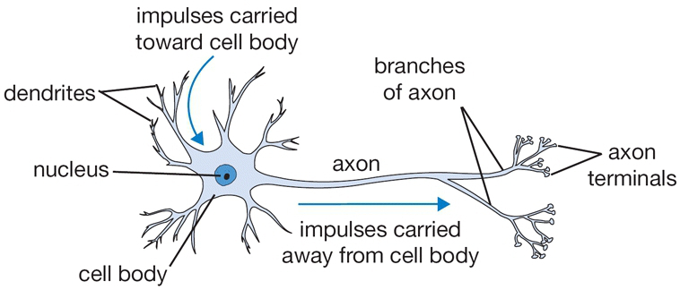
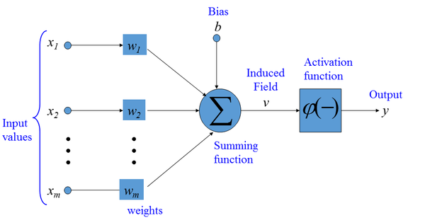

class: center, middle

## Artificial Intelligence

# Machine Learning

<br>

Gerard Escudero, 2020

<br>


---
class: left, middle, inverse

# Outline

* .cyan[Introduction]

* Distances

* Probabilities

* Rules

* Hyperplanes

* Learning Theory

* References

---

# Classification Data Example

.center[
class      | sepal <br> length | sepal <br> width | petal <br> length | petal <br> width 
:--------- | -----: | ----: | -----: | ----: 
setosa     | 5.1    | 3.5   | 1.4    | 0.2   
setosa     | 4.9    | 3.0   | 1.4    | 0.2   
versicolor | 6.1    | 2.9   | 4.7    | 1.4   
versicolor | 5.6    | 2.9   | 3.6    | 1.3    
virginica  | 7.6    | 3.0   | 6.6    | 2.1    
virginica  | 4.9    | 2.5   | 4.5    | 1.7   
150 rows or examples (50 per class).red[*] 
]

* The .blue[class] or .blue[target] column is usually refered as vector .blue[_Y_] 

* The matrix of the rest of columns (.blue[attributes] or .blue[features]) is usually referred
as matrix .blue[_X_]

.footnote[.red[*] _Source_ : _Iris_ problem UCI repository (Frank &amp; Asunción, 2010)]

---

# Main objective

.large[Build from data a .blue[model] able to give a prediction to new .blue[unseen] examples.]

.center[]

where:
* _data = previous table_
* _unseen = [4.9, 3.1, 1.5, 0.1]_
* _prediction = "setosa"_

---

# Regression Data Example

.center[
quality | density | pH   | sulphates | alcohol
------- | ------- | ---- | --------- | -------
6       | 0.998   | 3.16 | 0.58      | 9.8
4       | 0.9948  | 3.51 | 0.43      | 11.4
8       | 0.9973  | 3.35 | 0.86      | 12.8
3       | 0.9994  | 3.16 | 0.63      | 8.4
7       | 0.99514 | 3.44 | 0.68      | 10.55
1599 examples & 12 columns (11 attributes + 1 target).red[*]
]

The main diference between classification and regression is the _Y_ or target values:

* .blue[Classification]: discrete or nominal values <br>
Example: _Iris_, {“setosa”, “virginica”, “versicolor”}.

* .blue[Regression]: continuous or real values <br>
Example: _WineQuality_, values from 0 to 10.

.footnote[.red[*] _Source_ : _wine quality_ problem from UCI repository (Frank &amp; Asunción, 2010)]
 

---


# Some Applications

### Classification

  - Medicine: diagnosis of diseases

  - Engineering: fault diagnosis and detection

  - Computer Vision: face recognition

  - Natural Language Processing: spam filtering

### Regression

  - Medicine: estimation of life after an organ transplant

  - Engineering: process simulation, prediction

  - Computer Vision: Face completion

  - Natural Language Processing: opinion detection

---
class: left, middle, inverse

# Outline

* .brown[Introduction]

* .cyan[Distances]

  - .cyan[kNN]

  - Centroids

* Probabilities

* Rules

* Hyperplanes

* Learning Theory

* References

---

# Distance-based methods

### Induction principle: .blue[distances]

- **euclidean**:

$$de(v, w) = \sqrt{\sum_{i=1}^n(v_i-w_i)^2}$$

$$n=\text{\#attributes}$$

- **hamming**:

$$dh(v, w) = \frac{\sum_{i=1}^n \delta(v_i, w_i)}{n} $$
$$\delta(a, b)=1\text{, if } a\neq b$$
$$\delta(a, b)=0\text{, if } a = b$$ 

---

# Distance-based methods

### Documentation in .blue[sklearn]

.tiny[[https://scikit-learn.org/stable/modules/generated/sklearn.neighbors.DistanceMetric.html](https://scikit-learn.org/stable/modules/generated/sklearn.neighbors.DistanceMetric.html)]

### Some algorithms

- *k* Nearest Neightbors (kNN)

- Centroids (or Linear Classifier)

---

# Distance-based methods

* How can be give a prediction to next examples?

.center[
| class | sep-len | sep-wid | pet-len | pet-wid |
|:------|:--------|:--------|:--------|:--------|
| ??    | 4.9     | 3.1     | 1.5     | 0.1     |
Unseen classification example on _Iris_]

.center[
| target | density | pH   | sulphates | alcohol |
|:-------|:--------|:-----|:----------|:--------|
| ??     | 0.99546 | 3.29 | 0.54      | 10.1    |
Unseen regression example on _WineQuality_]

* Let’s begin with a representation of the problems...

---

# Classification Data Example


---

# Regression Data Example


---

# 1 Nearest Neighbors algorithm

### Algorithm
* classification & regression

$$h(T)=y_i$$

$$i = argmin_i (distance(X_i,T))$$

### Examples

* .blue[classification] example (Iris):
  - distances: [0.47, 0.17, 3.66, 2.53, 6.11, 3.45]
  - prediction = setosa (0.17)

* .blue[regression] example (WineQuality):
  - distances: [0.33, 1.32, 2.72, 1.71, 0.49] 
  - prediction = 6 (0.33)

---

# *k* Nearest Neighbors algorithm

### Algorithm 

1. build the set $S$ of $k$ $y_i$'s with minimum distance to unseen example $T$ (as in 1NN)

2. prediction:

$$h(T)=mode(S)\text{, if classification}$$

$$h(T)=average(S)\text{, if regression}$$

### Examples

- .blue[classification]: Iris \& euclidean distance

$$h(T)=mode({setosa, setosa, versicolor})=setosa$$

- .blue[regression]: WineQuality \& euclidean distance

$$h(T)=average({6,4,7})=5.7$$


---

# Some issues

- *k* value uses to be *odd* or *prime* number to avoid .blue[ties]

- an usual modification of the algorithm is to .blue[weight] points by the inverse of their distance in mode or average functions

- .blue[lazy learning]: it does nothing in learning step; it calculates all in classification step 

  - This can produce some problems real time applications

  - This mades *k*NN one of the most useful algorithm for missing values imputation

- .blue[nominal features]

  - changing the distance (ie: *hamming*)

  - codifying them as numerical (to see in lab)


---

# sklearn

#### .blue[Classification]:

```python3
from sklearn.neighbors import KNeighborsClassifier
k = 3
clf = KNeighborsClassifier(k)
```

#### .blue[Regression]:

```python3
from sklearn.neighbors import KNeighborsRegressor
k = 3
rgs = KNeighborsRegressor(k)
```

#### Usual parameters:

```python3
clf = KNeighborsClassifier(k, weights='distance')
# for weighted majority votes or average
```

#### User guide: 

.tiny[[https://scikit-learn.org/stable/modules/neighbors.html](https://scikit-learn.org/stable/modules/neighbors.html)]

---
class: left, middle, inverse

# Outline

* .brown[Introduction]

* .cyan[Distances]

  - .brown[kNN]

  - .cyan[Centroids]

* Probabilities

* Rules

* Hyperplanes

* Learning Theory

* References

---

# Classification Data Example

.center[]

---

# Centroids algorithm

#### .blue[Learn]: model=centroids (averaging columns for each class)

#### Example: Iris 

| centroids |   |   |   |   |
|-----------|---|---|---|---|
| setosa | 5.0 | 3.25 | 1.4 | 0.2 |
| versicolor | 5.85 | 2.9 | 4.15 | 1.35 |
| virginica | 6.25 | 2.75 | 5.55 | 1.9 |

#### .blue[Classify]: apply 1NN with centroids as data 

#### Example: Iris & euclidean distance 

$$distances = (0.23, 3.09, 4.65)$$

$$prediction=setosa (0.23)$$

---

# sklearn

#### .blue[Classification]:

```python3
from sklearn.neighbors import NearestCentroid
clf = NearestCentroid()
```

#### It has no parameters

#### User guide: 

.tiny[[https://scikit-learn.org/stable/modules/neighbors.html#nearest-centroid-classifier](https://scikit-learn.org/stable/modules/neighbors.html#nearest-centroid-classifier)]

---
class: left, middle, inverse

# Outline

* .brown[Introduction]

* .brown[Distances]

* .cyan[Probabilities]

  - .cyan[Naïve Bayes]

  - LDA & Logistic Regression

  - Sequences

* Rules

* Hyperplanes

* Learning Theory

* References

---

# Probability-based methods

| class      | cap-shape | cap-color | gill-size | gill-color |
|:-----------|:----------|:----------|:----------|:-----------|
| poisonous  | convex    | brown     | narrow    | black      |
| edible     | convex    | yellow    | broad     | black      |
| edible     | bell      | white     | broad     | brown      |
| poisonous  | convex    | white     | narrow    | brown      |
| edible     | convex    | yellow    | broad     | brown      |
| edible     | bell      | white     | broad     | brown      |
| poisonous  | convex    | white     | narrow    | pink       |
.center[up to 8 124 examples & 22 attributes .red[*]]


- What is $P(poisonous)$?

$$P(poisonous)=\frac{N(poisonous)}{N}=\frac{3}{7}\approx 0.429$$

.footnote[.red[*]  _Source_ : _Mushroom_ problem from UCI repository (Frank &amp; Asunción, 2010)]

---

# Naïve Bayes

#### Learning Model

$$\text{model}=[P(y)\simeq\frac{N(y)}{N},P(x_i|y)\simeq\frac{N(x_i|y)}{N(y)};\forall y \forall x_i]$$

.col5050[
.col1[
| $y$       | $P(y)$ |
|:----------|-------:|
| poisonous | 0.429  |
| edible    | 0.571  |
]
.col2[
| attr:value       | poisonous | edible |
|:-----------------|----------:|-------:|
| cap-shape:convex | 1         | 0.5    |
| cap-shape:bell   | 0         | 0.5    |
| cap-color:brown  | 0.33      | 0      |
| cap-color:yellow | 0         | 0.5    |
| cap-color:white  | 0.67      | 0.5    |
| gill-size:narrow | 1         | 0      |
| gill-size:broad  | 0         | 1      |
| gill-color:black | 0.33      | 0.25   |
| gill-color:brown | 0.33      | 0.75   |
| gill-color:pink  | 0.33      | 0      |
]
]

---

# Naïve Bayes

#### Classification

$$h(T) \approx argmax_y P(y)\cdot P(t_1|y)\cdot\ldots\cdot P(t_n|y)$$

- Test example $T$:

| class | cap-shape | cap-color | gill-size | gill-color |
|:------|:----------|:----------|:----------|:-----------|
| ??    | convex    | brown     | narrow    | black      |

- Numbers:
$$P(poisonous|T) = 0.429 \cdot 1 \cdot 0.33 \cdot 1 \cdot 0.33 = 0.047$$
$$P(edible|T) = 0.571 \cdot 0.5 \cdot 0 \cdot 0 \cdot 0.25 = 0$$
- Prediction: $$h(T) = poisonous$$

---

# Naïve Bayes

#### Notes

- It needs a smoothing technique to avoid zero counts <br>
  - Example: Laplace
$$P(x_i|y)\approx\frac{N(x_i|y)+1}{N(y)+N}$$

- It is empiricaly a decent classifier but a bad estimator
  - This means that $P(y|T)$ is not a good probability 

#### Implementation

- Using LINQ of C#: [view](codes/naiveBayes.html).red[*] / [output](codes/modelNB.txt) / [download code](codes/naiveBayes.cs)

.footnote[.red[*] Formated with http://hilite.me/]

---

# Gaussian Naïve Bayes I

* How about numerical features?

| Brake? | Distance | Speed |
|-------:|---------:|------:|
| Y      | 2.4      | 11.3  |
| Y      | 3.2      | 70.2  |
| N      | 75.7     | 72.7  |
| N      | 2.8      | 15.2  |
| %?     | 79.2     | 12.1  |
.center[Source: (Millington, 2019)]

$$P(x_i|y)=\frac{1}{\sqrt{2\pi\sigma_y^2}}\exp\left(-\frac{(x_i-\mu_y)^2}{2\sigma_y^2}\right)$$

.center[where $\mu_y=\frac{x_1^y+\cdots+x_n^y}{n_y}$ and $\sigma_y^2=\frac{(x_1^y - \mu_y)^2+\cdots+(x_n^y - \mu_y)^2}{n_y}$]


---

# Gaussian Naïve Bayes II

.col5050[
.col1[
**Learning model:**

| $y$  | $P(y)$ |
|:-----|-------:|
| Y    | 0.5    |
| N    | 0.5    |

<br>

|                 | Distance | Speed     |
|:----------------|---------:|----------:|
| $\mu_Y$         | 2.8      | 40.75     |
| $\mu_N$         | 39.25    | 43.95     |
| $\sigma_Y^2$    | 0.32     | 1734.605  |
| $\sigma_N^2$    | 2657.205 | 1653.125  |
]
.col2[
**Classification:**

$$P(Y|T)=0.5\cdot 0.0\cdot 0.00756 = 0.0$$

$$P(N|T)=0.5\cdot 0.00573\cdot 0.00722 = 0.00002$$

$$h(T)=N$$

**Note:**

$$P(speed=12.1|Y)=\frac{1}{\sqrt{2\cdot\pi\cdot 1734.605}}\cdot$$

$$\cdot \exp\left(-\frac{(12.1-40.75)^2}{2\cdot 1734.605}\right)=0.00669$$
]]

---

# Gaussian Naïve Bayes III

**Implementation:**

- Using LINQ of C#: 

  - [view](codes/gaussianNaiveBayes.html).red[*] 

  - [output](codes/modelGNB.txt)

  - [download code](codes/gaussianNaiveBayes.cs)

.footnote[.red[*] Formated with http://hilite.me/]

---

# Decision Trees

**Splitting measure:**

- Decision Trees: $accuracy=\frac{N(ok)}{N}$

- ID3: $entropy=-\sum_{\forall y} P(y) \cdot log_2(P(y))$

- CART: $gini = 1 - \sum_{\forall y} P(y)^2$ + binary trees

- .blue[Our approach]: $gini$ + k-ary trees

  - nominal and numeric features

  - classification and regression

  - one of the easiest decision trees

---

# Example I

.cols5050[
.col1[
| class      | cap-shape | cap-color |
|:-----------|:----------|:----------|
| poisonous  | convex    | brown     |
| edible     | convex    | yellow    |
| edible     | bell      | white     |
| poisonous  | convex    | white     |
| edible     | convex    | yellow    |
| edible     | bell      | white     |
| poisonous  | convex    | white     |
]
.col2[
**algorithm:**

each node of the tree from 

the minimum weighted sum of

 _Gini index_:

.small[$gini = 1 - \sum_{\forall y} P(y)^2$]
]]

---

# Example II

**cap-shape:**

| cap-shape | poisonous | edible | #examples |
|----------:|----------:|-------:|----------:|
| convex    | 3         | 2      | 5         |
| bell      | 0         | 2      | 2         |

.small[
.blue[For each _value_:]

$gini(\text{cap-shape}=\text{convex})=1-(\frac{3}{5})^2-(\frac{2}{5})^2=0.48$

$gini(\text{cap-shape}=\text{bell})=1-(\frac{0}{2})^2-(\frac{2}{2})^2=0.0$

.blue[_Weighted sum_:]

$gini(\text{cap-shape})=\frac{5}{7}\cdot 0.48+\frac{2}{7}\cdot 0.0=0.343$
]

---

# Example III

**cap-color:**

| cap-color | poisonous | edible | #examples |
|----------:|----------:|-------:|----------:|
| brown     | 1         | 0      | 1         |
| yellow    | 0         | 2      | 2         |
| white     | 2         | 2      | 4         |

.small[
.blue[For each _value_:]

$gini(\text{cap-color}=\text{brown})=1-(\frac{1}{1})^2-(\frac{0}{1})^2=0.0$

$gini(\text{cap-color}=\text{yellow})=1-(\frac{0}{2})^2-(\frac{2}{2})^2=0.0$

$gini(\text{cap-color}=\text{white})=1-(\frac{2}{4})^2-(\frac{2}{4})^2=0.5$

.blue[_Weighted sum_:]

$gini(\text{cap-color})=\frac{1}{7}\cdot 0.0+\frac{2}{7}\cdot 0.0+\frac{4}{7}\cdot 0.5=0.286$
]

---

# Example IV

**Selecting best feature:**

- best feature will be that with minimum _gini index_:

.small[
$$\text{best_feature}=\min((0.343,\text{cap-shape}),(0.286,\text{cap-color}))=\text{cap-color}$$
]

- every value with only a class will be a _leaf_:
  - brown $\rightarrow$ poisonous
  - yellow $\rightarrow$ edible

- a new set is built for the rest of values

.center[
| class      | cap-shape |
|:-----------|:----------|
| edible     | bell      |
| poisonous  | convex    |
| edible     | bell      |
| poisonous  | convex    |
_white_ examples without _cap-color_
]

- the process restarts with the new set

---

# Example V

**Resulting Tree:**

.center[

]


---

# Cutting Points I

**What about numerical attributes?**

| class      | width |
|:-----------|------:|
| versicolor | 2.9   |
| versicolor | 2.9   |
| virginica  | 3.0   |
| virginica  | 2.5   |

**Cutting points:**

| class      | width | cutting points | weighted ginis |
|:-----------|------:|---------------:|:---------------|
| virginica  | 2.5   |      |   | 
| versicolor | 2.9   | 2.7  | $\frac{1}{4}\cdot 0.0+\frac{3}{4}\cdot 0.45=0.0.3375$ |
| versicolor | 2.9   |      |   |
| virginica  | 3.0   | 2.95 | $\frac{3}{4}\cdot 0.45+\frac{1}{4}\cdot 0.0=0.0.3375$ |
.center[.small[cutting points for _width_ attribute]]

---

# Cutting Points II

**Gini example:**

| width | versicolor | virginica | #examples | gini |
|:------|-----------:|----------:|----------:|:-----|
| < 2.7 | 0 | 1 | 1 | $1-(\frac{0}{1})^2-(\frac{1}{1})^2=0$ |
| > 2.7 | 2 | 1 | 3 | $1-(\frac{2}{3})^2-(\frac{1}{3})^2=0.45$ |

**Resulting Tree:**

.center[

]

---

# Regression

- standard deviation as splitting measure

$$\sigma=\sqrt{\frac{(x_1-\mu)^2+\dots+(x_n-\mu)^2}{n}}$$

.center[where $\mu=\frac{x_1+\dots+x_n}{n}$]

.cols5050[
.col1[
**example:**

| target | outlook | wind   |
|:-------|:--------|:-------|
| 25     | sun     | weak   |
| 30     | sun     | strong |
| 52     | rain    | weak   |
| 23     | rain    | strong |
| 45     | rain    | weak   |
.center[.small[[Source](https://sefiks.com/2018/08/28/a-step-by-step-regression-decision-tree-example/)]]
]
.col2[
**total amounts:**

$$\mu=35$$
$$\sigma=11.472$$
]]

---

# Regression II

.cols5050[
.col1[
**outlook:**

| outlook | $\mu$ | $\sigma$ | #examples |
|:--------|------:|---------:|----------:|
| sun     | 27.5  | 2.5      | 2         |
| rain    | 40.0  | 12.356   | 3         |
]
.col2[
**weighted sum:**

$$\sigma_{weighted}=\frac{2}{5}\cdot 2.5+\frac{3}{5}\cdot 12.356=8.414$$

**$\sigma$ reduction:**
$$\sigma_{reduction}=11.543-8.414=3.129$$
]]

.cols5050[
.col1[
**wind:**

| wind   | $\mu$  | $\sigma$ | #examples |
|:-------|-------:|---------:|----------:|
| weak   | 40.667 | 11.441   | 3         |
| strong | 26.5   | 3.5      | 2         |
]
.col2[
**weighted sum:**

$$\sigma_{weighted}=\frac{3}{5}\cdot 11.441+\frac{2}{5}\cdot 3.5=8.265$$

**$\sigma$ reduction:**
$$\sigma_{reduction}=11.543-8.265=3.278$$
]]

Wins the highest score: .blue[**wind**]

---

# Notes on Decision Trees

- Tends to overfitting when leafs with few examples

- High variance
  - small changes in training sets produce different trees

- **Prunning**: for avoiding overfitting
  - less than 5 instances 
  - maximum depth

- Previous regression tree by averaging leaf instances:
 
.center[]

---
class: left, middle, inverse

# Outline

* .brown[Introduction]

* .brown[Machine Learning]

* .cyan[Deep Learning]

* Reinforcement Learning

* Unity ML-Agents Toolkit

* Genetic Algorithms

* References

---

# Artificial Neuron Model

.center[]

.center[]

.footnote[Source: [Artificial Neuron](http://www.gabormelli.com/RKB/Artificial_Neuron)]

---

# Perceptron

.cols5050[
.col1[

- Classification and regression

- Linear model

- Classification:

$$h(x)=f(\sum_{i=1}^n w_i x_i + b)$$

- Learning rule:

$$w_i'=w_i+\eta(h(x)-y)$$
]
.col2[


]]

- Example in sklearn:
  - [view](codes/nn-sklearn.html) / [download](codes/nn-sklearn.ipynb) / [reference](https://scikit-learn.org/stable/modules/generated/sklearn.linear_model.Perceptron.html)

---

# Multi-layer Perceptron

.col5050[
.col1[- One hidden layer

- Non-linear model

- Classification & regression

- [Backpropagation](https://en.wikipedia.org/wiki/Backpropagation) as training algorithm

- Example in sklearn:
  - [view](codes/nn-sklearn.html) / [download](codes/nn-sklearn.ipynb) / [reference](https://scikit-learn.org/stable/modules/generated/sklearn.neural_network.MLPClassifier.html#sklearn.neural_network.MLPClassifier)

- Main parameters:
  - hidden_layer_sizes
  - activation
  - max_iter

]
.col2[

]]

.footnote[Source: [wikipedia](https://en.wikipedia.org/wiki/Artificial_neural_network)]

---

# Bias, Variance & Overfitting


Normal use of a validation set to select parameters & avoid overfitting (to much learning)!

.footnote[Source: [left](https://towardsdatascience.com/regularization-the-path-to-bias-variance-trade-off-b7a7088b4577), [right](https://elitedatascience.com/overfitting-in-machine-learning)]

---

# Deep Learning

- Neural network with 2 or more hidden layers


.cols5050[
.col1[

]
.col1[
**Examples:**

- Sklearn on Iris
  - [view](codes/nn-sklearn.html) / [download](codes/nn-sklearn.ipynb)

- Keras on MNIST
  - [view](codes/keras-mlp.html) / [download](codes/keras-mlp.ipynb) / [Source](https://github.com/keras-team/keras)
]
]

.footnote[Source: [The Neural Network Zoo](https://www.asimovinstitute.org/neural-network-zoo/)]

---

# Convolutional Neural Networks

**from Computer Vision**

to process image & video


.footnote[Source: [A Comprehensive Guide to Convolutional Neural Networks](https://towardsdatascience.com/a-comprehensive-guide-to-convolutional-neural-networks-the-eli5-way-3bd2b1164a53)]

---

# Convolutional Neural Networks II

.cols5050[
.col1[
- Convolution: extract the high-level features such as edges

- Pooling: reduce dimensionality for 
  - computational cost
  - extracting dominant features which are rotational and positional invariant

- Example:
  - Keras on MNIST
  - [view](codes/keras-cnn.html) / [download](codes/keras-cnn.ipynb) / [Source](https://github.com/keras-team/keras)
]
.col2[


]]

.footnote[Source: [A Comprehensive Guide to Convolutional Neural Networks](https://towardsdatascience.com/a-comprehensive-guide-to-convolutional-neural-networks-the-eli5-way-3bd2b1164a53)]

---

# The Neural Network Zoo


.footnote[Source: [The Neural Network Zoo](https://www.asimovinstitute.org/neural-network-zoo/)]

---

# The Neural Network Zoo II


.footnote[Source: [The Neural Network Zoo](https://www.asimovinstitute.org/neural-network-zoo/)]

---

# The Neural Network Zoo III


.footnote[Source: [The Neural Network Zoo](https://www.asimovinstitute.org/neural-network-zoo/)]

---
class: left, middle, inverse

# Outline

* .brown[Introduction]

* .brown[Machine Learning]

* .brown[Deep Learning]

* .cyan[Reinforcement Learning]

* Unity ML-Agents Toolkit

* Genetic Algorithms

* References

---

# Reinforcement Learning


.cols5050[
.col1[
- an _agent_
- a set of states $S$
- a set of actions $A$

]
.col2[
Learning a reward function $Q: S \times A \to \mathbb{R}$ for maximizing the total future reward.

]]

- _Q-Learning_: method for learning an aproximation of $Q$.

.footnote[Source: [My Journey Into Deep Q-Learning with Keras and Gym](https://medium.com/@gtnjuvin/my-journey-into-deep-q-learning-with-keras-and-gym-3e779cc12762)]

---

# Reinforcement Learning II

Training example:

.center[]

.footnote[Source: [Reinforcement Q-Learning from Scratch in Python with OpenAI Gym](https://www.learndatasci.com/tutorials/reinforcement-q-learning-scratch-python-openai-gym/)]

---

# Reinforcement Learning Example

- Simple example of Q-learning & Q-Table.

.center[[](figures/ooops.mp4)]

- [Unity Package](codes/ooops.unitypackage) (in Spanish)
  - See the folder _Scripts_ in _Assets_

---

# Deep Reinforcement Learning I

- Convolutional Neural Network for learning $Q$ <br>

.center[[](https://www.youtube.com/watch?v=TmPfTpjtdgg&feature=youtu.be)]

.footnote[Source: [Deep Reinforcement Learning](https://deepmind.com/blog/article/deep-reinforcement-learning)]

---

# Deep Reinforcement Learning II

**Example:** 

- CartPole from [OpenAi Gym](https://gym.openai.com/):

.center[]

- [Deep Q-Learning with Keras and Gym](https://keon.io/deep-q-learning/)

---
class: left, middle, inverse

# Outline

* .brown[Introduction]

* .brown[Machine Learning]

* .brown[Deep Learning]

* .brown[Reinforcement Learning]

* .cyan[Unity ML-Agents Toolkit]

* Genetic Algorithms

* References

---

# ML-Agents

Unity plugin for training intelligent agents.

[](https://www.youtube.com/watch?v=Hg3nmYD3DjQ&feature=youtu.be)

Address: https://github.com/Unity-Technologies/ml-agents

Contain .blue[Deep Learning] & .blue[Reinforcement Learning]

---
class: left, middle, inverse

# Outline

* .brown[Introduction]

* .brown[Machine Learning]

* .brown[Deep Learning]

* .brown[Reinforcement Learning]

* .brown[Unity ML-Agents Toolkit]

* .cyan[Genetic Algorithms]

* References

---

# Optimisation I

- **Problem**: setting parameters

- Example 1:

    - Strategy Game with diferent kind of units

    - Every unit have diferent attributes (attack, defense, life points)
 
    - All the units have to be useful

    - We need to balance them

- Example 2:

    - Game difficulty level adjustment

- Example 3:

    - Setting parameters of a Machine Learning algorithm

- Example 4:

    - Learning behaviour

---

# Optimisation II

- Exemple: Strategy Game

  - 10 unit types

  - 3 attributes (attack, defense, life)

  - 20 possible values (1..20)

  - possible combinations will be $20^{3\times 10}$

  - testing all combinations is impossible

- **Solution**: 

  - Find a _reasonably_ good solution in a limited time

  - .blue[Optimisation algorithms]

---

# Genetic Algorithm I

Given a problem $P$ with a solution space $S$, the main components are:

- .blue[Chromosome] (solution): collection of .blue[genes] (parameters)

- .blue[Population]: collection of chromosomes

- .blue[Fitness function]: scores how good is a solution

- .blue[Selection]: selects best chromosomes

- .blue[Crossover]: from 2 random chromosomes & a random point:
  * requirements: $2\times n$ parents for each $n$ new chromosomes

.center[]

---

# Genetic Algorithm II

- .blue[Mutation]: change a value
  - Probability of mutation (<10%)
  - Random index
  - Random number to add or substract

.center[]

.cols5050[
.col1[
**Algorithm:**

```
1. Random Population
2. Compute fitness
3. Selection 
4. Crossover
5. Mutation
6. Go to step 2
```

- Example: [demo](figures/maze.mp4) / [reference](https://github.com/Sebastian-Schuchmann/Genetic-Algorithm-in-Unity3D)
]
.col2[

]]


---
class: left, middle, inverse

# Outline

* .brown[Introduction]

* .brown[Machine Learning]

* .brown[Deep Learning]

* .brown[Reinforcement Learning]

* .brown[Unity ML-Agents Toolkit]

* .brown[Genetic Algorithms]

* .cyan[References]

---

# References

- Ian Millington. _AI for Games_ (3rd edition). CRC Press, 2019.

- Gerard Escudero. [_Supervised Machine Learning_](https://gebakx.github.io/classification/slides/machineLearning.pdf). 2019. 

- Sefik Ilkin Serengil. [_A Step by Step CART Decision Tree Example_](https://sefiks.com/2018/08/27/a-step-by-step-cart-decision-tree-example/). 2018. It also contains a regression example.

- Aurélien Géron. _Hands-On Machine Learning with Scikit-Learn, Keras & Tensorflow_, 2nd Edition. O'Reilly, 2019.

- [_Keras Documentation_](https://keras.io/). 

- DeepMind. [Deep Reinforcement Learning](https://deepmind.com/blog/article/deep-reinforcement-learning).

- Micheal Lanham. _Learn Unity ML-Agents - Fundamental of Unity Machine Learning_. Packt, 2018.

- Károly Zsolnai-Fehér. [OpenAI Plays Hide and Seek…and Breaks The Game!](https://www.youtube.com/watch?v=Lu56xVlZ40M). Two Minute Papers.

- Károly Zsolnai-Fehér. [DeepMind’s AlphaStar: A Grandmaster Level StarCraft 2 AI](https://www.youtube.com/watch?v=jtlrWblOyP4). Two Minute Papers.


